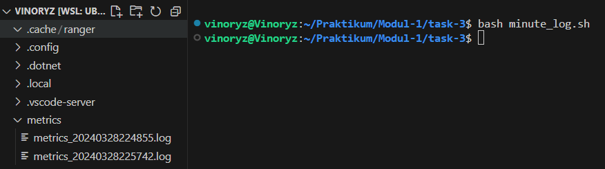

# Task
## Task 1

## Task 2

## Task 3
### Cara pengerjaan
#### Problem a
Kode pertama yaitu minute_log.sh yang ada pada task-3. Untuk hasil run dari minute_log.sh sudah saya letakkan di /resource/metrics_{%Y%m%d%H%M%S}.
Pada awal kode tersebut saya membuat beberapa variabel untuk menyimpan waktu saat ini dan tujuan direktori yang akan memudahkan saya untuk membuat file log nantinya. Saya juga membuat 3 variabel untuk menyimpan hasil awk dari free -m dan juga du -sh yang kemudian saya menggabungkan semuanya dan dimasukkan ke dalam 1 variabel yang bernama allMetrics.  
- Hasil screeshot
  
## Task 4

