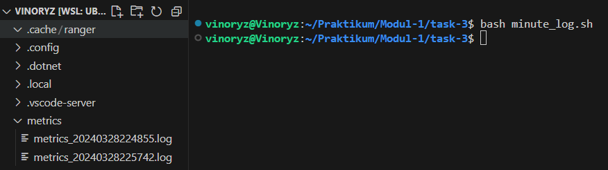
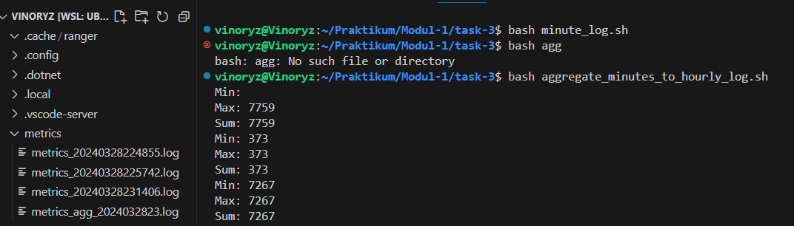

# Task
## Task 1
### Cara pengerjaan
#### Problem a
Pada script ini saya langsung menggunakan awk untuk mencari nama pengusul yang mengusulkan judul yang memiliki lebih dari 20 kata.
- Hasil screeshot
  

#### Problem b
Pada script ini saya langsung menggunakan awk untuk mencari skema paling populer.
- Hasil screeshot
  

#### Problem c
Pada script ini saya membuat 2 variabel yang menyimpan path direktori dan nama file untuk memudahkan target file. Dilanjutkan dengan awk yang digunakan untuk mencari pengusul yang mengusulkan lebih dari 1 judul.
- Hasil screeshot
  

### Kendala
Tidak terdapat kendala pada pengerjaan task-1 sehingga pengerjaan task-1 berjalan lancar.
## Task 2

## Task 3
### Cara pengerjaan
#### Problem a
Script pertama yaitu minute_log.sh yang ada pada task-3. Untuk hasil run dari minute_log.sh sudah saya letakkan di /resource/metrics_{%Y%m%d%H%M%S}.
Pada awal kode tersebut saya membuat beberapa variabel untuk menyimpan waktu saat ini dan tujuan direktori yang akan memudahkan saya untuk membuat file log nantinya. Saya juga membuat 3 variabel untuk menyimpan hasil awk dari free -m dan juga du -sh yang kemudian saya menggabungkan semuanya dan dimasukkan ke dalam 1 variabel yang bernama allMetrics.

Script dirun kemudian akan menghasilkan sebuah file log yang sesuai dengan jam saat script tersebut dirun yang akan disimpan pada /home/$USER/metrics
- Hasil screeshot
  
  
#### Problem b
Untuk konfigurasi crontabnya terdapat pada file /task-3/crontab

#### Problem c
Script ini digunakan untuk mengambil seluruh data yang ada pada file yang terbuat dalam kurun jam tertentu. Pada script ini saya menggunakan awk untuk mendapatkan isi dari file tersebut yang kemudian dioperasikan setelah mendapatkan seluruh data dari file yang ada pada jam tertentu. Hasil dari run script ini diletakkan pada direktori yang sama dengan file log yang terbuat pada tiap menitnya yaitu di direktori /home/$USER/metrics.
- Hasil screenshot
  

#### Problem d
Pada problem ini saya tidak membuatnya karena problem c belum selesai

### Kendala
Kendala yang saya alami saat mengerjakan task-3 yaitu pada problem c. Pada problem c ini saya memang berhasil mendapatkan hasil dari awk namun ketika hasilnya tersebut ingin dipassing ke luar dari awk dan dimasukkan ke dalam variable bash terdapat sebuah kesalahan yang menyebabkan hasil dari awk tidak bisa tersimpan dalam variable bash tersebut. Akibatnya pada file metrics_agg tertulis 99999 dan 0 0 0 0.

## Task 4

